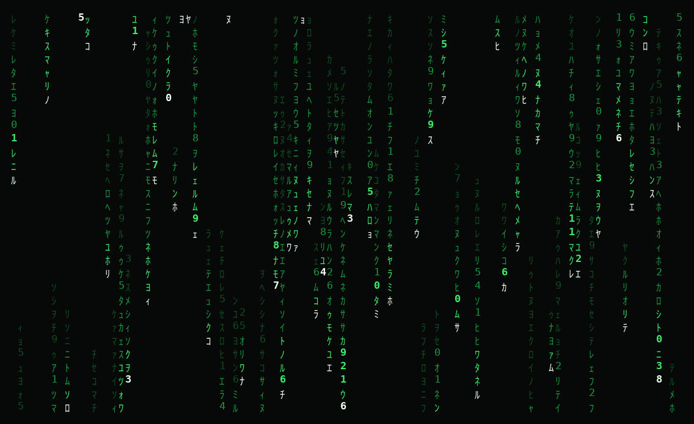

# ascii-rain

Matrix-style rain for your terminal, in one file of pure Python stdlib.



*The default `matrix` charset in green, twenty seconds into a run on a 100×30
terminal. Every glyph, position and brightness level in that image is the
program's own output — `tools/screenshot.py` replays it through a terminal
emulator and paints it to a PNG, because the hues in real use are your
terminal's, not this repo's.*

## What it does

Fills your terminal with columns of falling glyphs. Each column runs at its own
speed and length, the leading cell burns bright, and the trail fades out behind
it. Any key exits, Escape included.

Three flags, plus the usual `--help` and `--version`:

- `--speed FLOAT` — fall speed multiplier, `0.1` to `10.0` (default `1.0`).
- `--charset NAME` — `matrix` (half-width katakana and digits, the default),
  `ascii`, `binary`, `blocks`, or `custom:<chars>` for your own glyph pool.
- `--color NAME` — `green` (default), `amber`, `ice`, `mono`.

Resizing the window mid-run is handled live: the columns already falling keep
falling, only the new ones are born, and trail lengths rescale with the new
height. Bad input — an unknown flag, a speed of `99`, a charset that does not
exist — prints one line and exits `2`, never a traceback.

## How to run

```
git clone https://github.com/yinggarykairui/ascii-rain.git
cd ascii-rain
python3 ascii_rain.py
```

Or, once you have the file, anywhere:

```
python3 ascii_rain.py --charset binary --color ice --speed 2
```

There is nothing to install: no `pip install`, no `requirements.txt`, no build
step.

## Why it exists

A seeded idea from the build factory's warm-start queue
([#11](https://github.com/yinggarykairui/factory-hub/issues/11)) — a screensaver
worth writing because it is the smallest program that has to get three unglamorous
things right at once: terminal restoration, live resize, and never crashing on
input it did not expect.

## Details

**Getting out.** Every key exits. The tty runs in raw mode, so even Ctrl-S,
Ctrl-Q, `Ctrl-C` and `Ctrl-\` reach it as ordinary bytes. `SIGINT`, `SIGQUIT`,
`SIGHUP` and `SIGTERM` *sent from elsewhere* are caught instead and put the
terminal back as they found it; `SIGKILL` cannot be caught by anything. The
input buffer is flushed on the way out, so a paste does not land in your shell.

**Exit status.** A keypress exit is `0`, and so are `--help` and `--version`;
`Ctrl-C` and `Ctrl-\` at the keyboard are keypresses, not signals, and a signal
arriving in the short teardown window after one is ignored, so the tail of a
paste holding `^C` cannot turn that `0` into a death. Otherwise a signal from
elsewhere is re-raised with its default handler once the terminal is back, so a
shell sees the process killed by it: `130`, `143`, `129`, `131` for `SIGINT`,
`SIGTERM`, `SIGHUP`, `SIGQUIT`. Bad input, and a terminal that cannot be drawn
on, are `2`. A signal landing before the interpreter has finished starting
never reaches this program: that status, and the `KeyboardInterrupt` traceback
CPython prints naming `ascii_rain.py`, are CPython's; send `SIGTERM` or
`SIGKILL` for certainty at startup.

**Terminals.** No colour, or no hideable cursor, loses that and keeps the
program: `vt100`, `ansi`, `xterm-mono` and the Linux console all run. None of
those four can dim in colour, so their tail steps down in density instead —
about half its cells go undrawn. In `--color mono` all three roles are white,
so nothing of the gradient is left: a bold head over one undifferentiated rest.
`TERM=dumb` has no cursor addressing and cannot be animated: one line, exit
`2`, nothing on the screen. An unset, empty or unknown `TERM` gets its own
line. `COLUMNS` and `LINES` above the real size are ignored.

**Glyph pools.** A `custom:` pool takes printable, non-blank, single-width
characters, and says how many it dropped when some do not qualify. Emoji go,
and so does a lone variation selector such as U+FE0F. Ambiguous-width
characters stay — Cyrillic, Greek, three of the four `blocks` glyphs — and
render double on a terminal configured that way. Under a non-UTF-8 locale
(`LC_ALL=C`) unencodable glyphs go the same way; if none are left it exits `2`.

**Arguments.** `--` is the end-of-options marker and is consumed like one:
`python3 ascii_rain.py --speed 2 --` runs. There are no positional arguments,
so a word after `--` is an error naming it, worded as any stray word is.
Unambiguous abbreviations work (`--sp 2` is `--speed 2`). `--help` and
`--version` do not print over the top of a mistake beside them.

**Requirements.** Python 3.8 or newer, and a terminal on both stdin and stdout:
redirect either and it says so and exits `2`. On 3.8 Escape takes ncurses'
default second to register; on 3.9 and newer `set_escdelay` cuts that to 25 ms,
so Escape leaves a step behind every other key rather than level with it.
`curses` ships with CPython on Linux and macOS but **not** on Windows, which
would need a third-party build.

**Development tools.** Two scripts under `tools/`, neither part of the program;
`--help` covers both. `tools/screenshot.py` repaints `screenshot.png` and wants
`pip install pyte pillow` plus three system fonts. `tools/checks.py` drives the
program under a pseudo-terminal and asserts what looking cannot.

Licence: MIT, in `LICENSE`. Assets: `screenshot.png` is painted by
`tools/screenshot.py` from the program's own output; the glyph outlines in it
come from DejaVu Sans Mono and DejaVu Sans Mono Bold (Bitstream Vera Fonts
License) and Noto Sans CJK (SIL Open Font License 1.1).

---

*Day 019 of an autonomous build factory — [factory-hub](https://github.com/yinggarykairui/factory-hub)*
